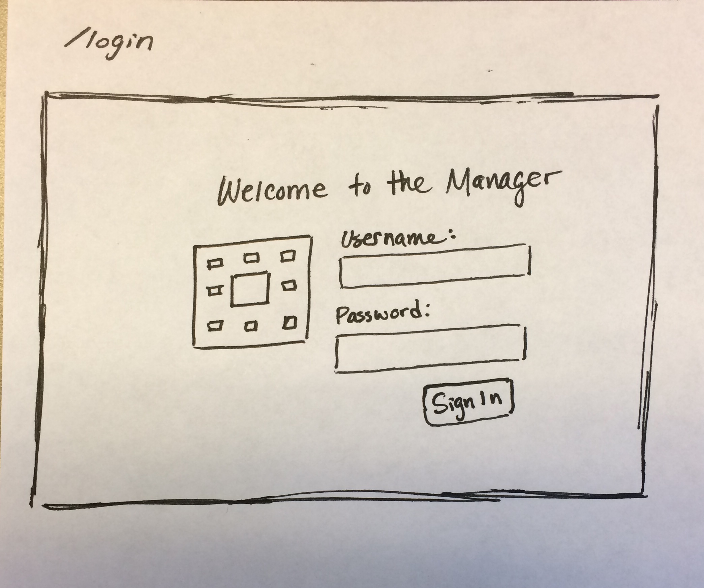
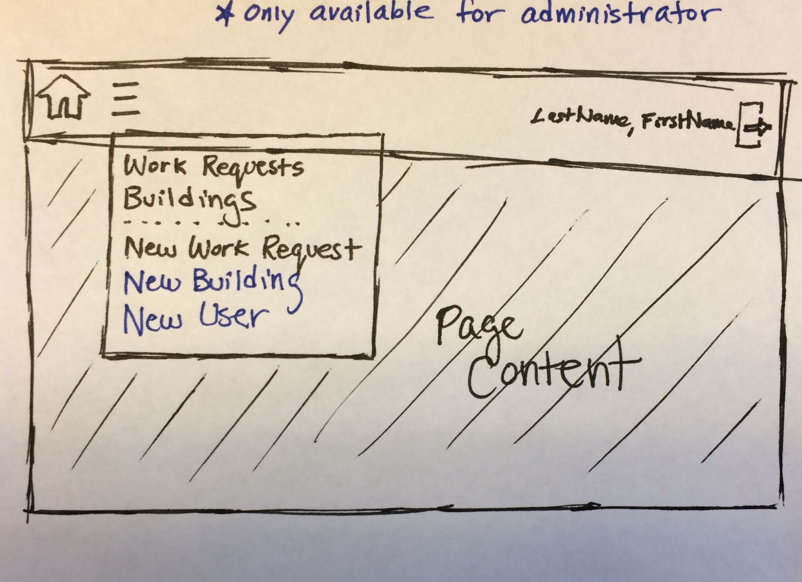
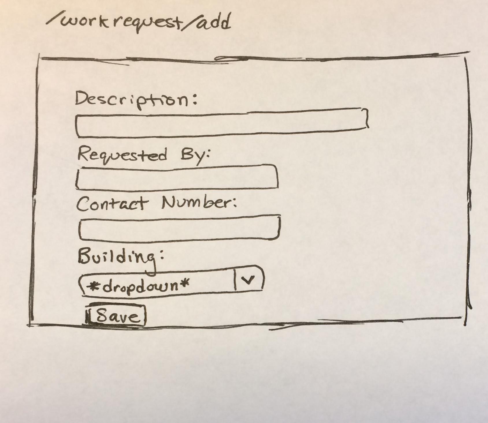
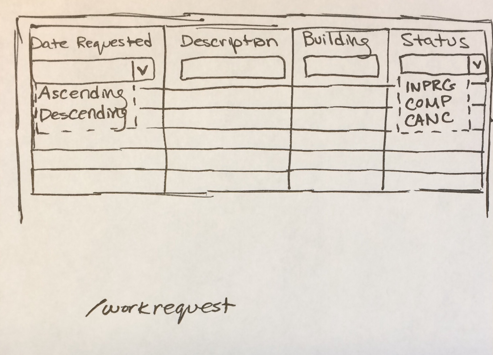
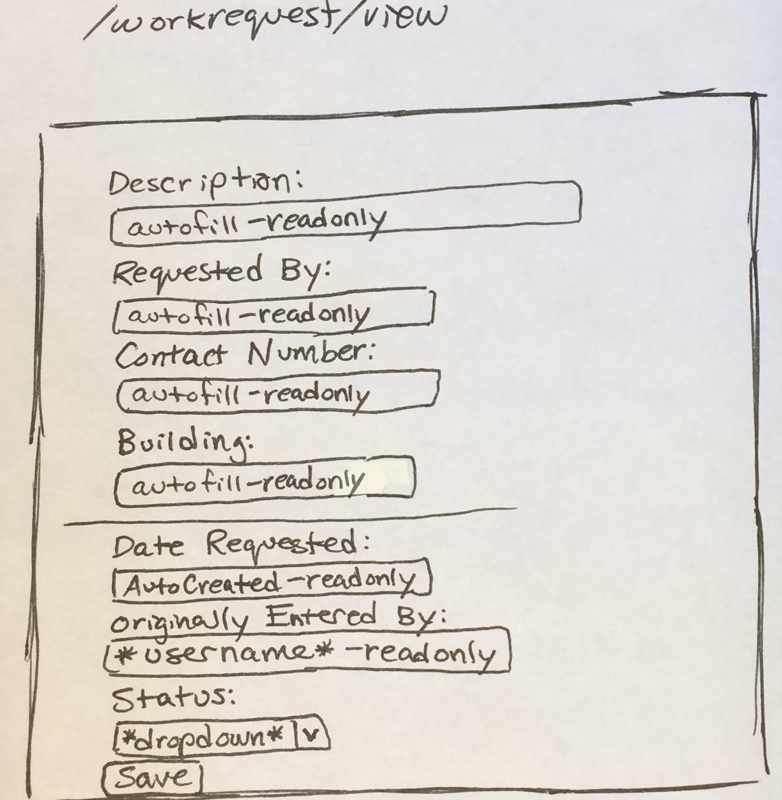

# Project Planning
For this assignment, you'll create some initial plans for your project.

## Assignment Description
[Project Planning Assignment](https://education.launchcode.org/liftoff/assignments/planning/)

## Submission Instructions

### Wireframes

### Project Tracker

[Story Mapping/User Story](https://www.pivotaltracker.com/n/projects/2184785)

### GitHub

[Project Repository](https://github.com/amanda7641/WRAAM)

